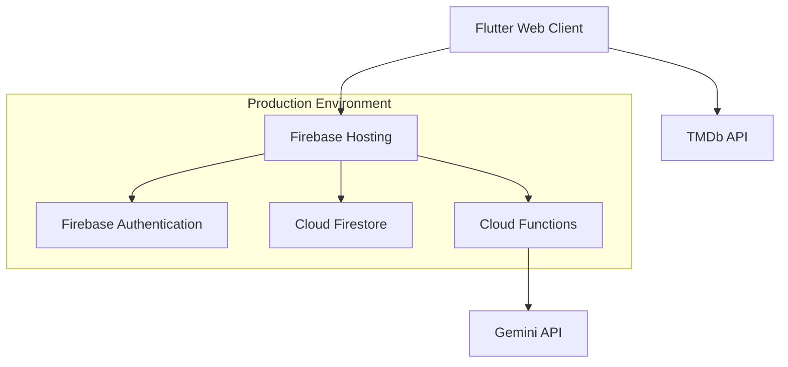

# FilmFlow - インテリジェント映画レコメンデーションシステム

🎬 **本番稼働中** - AIを活用したパーソナライズ映画推薦システム

[](https://movie-recommendation-sys-21b5d.web.app)


## 🚀 プロダクション情報

### 📍 アクセス
- **本番URL**: https://movie-recommendation-sys-21b5d.web.app
- **ステータス**: 🟢 稼働中
- **最終更新**: 2025年6月24日

### 🎯 完成機能
- ✅ Firebase認証（Google/匿名サインイン）
- ✅ 映画検索・詳細表示（TMDb API統合）
- ✅ レビューシステム（投稿・編集・削除・履歴）
- ✅ AI推薦システム（Cloud Functions + Gemini API）
- ✅ レスポンシブUI（PC・タブレット・スマホ対応）
- ✅ ダークモード・テーマ切り替え
- ✅ 年指定映画検索機能
- ✅ ユーザープロフィール・設定画面

## 🎯 プロジェクト概要

FilmFlowは、映画愛好家のためのAI駆動型レコメンデーションシステムです。ユーザーが投稿したレビューをGoogle CloudのAIサービスで分析し、個々の嗜好に基づいてパーソナライズされた映画推薦を提供します。

### 🌟 主な特徴

- **🤖 AI分析**: Gemini APIによるレビュー感情・嗜好分析
- **📊 ハイブリッド推薦**: 協調フィルタリング + コンテンツベース
- **🔍 高度検索**: 年代指定・ジャンル・キーワード検索
- **📱 PWA対応**: インストール可能なWebアプリ
- **🛡️ セキュリティ**: Firebase Security Rules + HTTPS強制
- **⚡ 高性能**: Flutter Web最適化 + CDN配信

## 🏗️ システムアーキテクチャ

### 技術スタック

**フロントエンド**
- Flutter Web ^3.7.2
- Riverpod ^2.6.1 (状態管理)
- Material Design 3

**バックエンド**
- Firebase Authentication
- Cloud Firestore
- Cloud Functions (TypeScript)
- Firebase Hosting

**AI・外部API**
- Google Gemini API
- TMDb API (映画データ)

### システム構成図



## 📚 ドキュメント

### 🔄 アクティブ文書
- [⚙️ CLAUDE.md](CLAUDE.md) - 開発ガイド（最新）
- [📋 docs/TODO.md](docs/TODO.md) - 継続タスク管理
- [🚀 docs/DEPLOYMENT_STATUS.md](docs/DEPLOYMENT_STATUS.md) - デプロイ状況
- [🔐 docs/OAUTH_SETUP.md](docs/OAUTH_SETUP.md) - OAuth設定手順
- [📖 docs/API_DOCUMENTATION.md](docs/API_DOCUMENTATION.md) - API仕様
- [👤 docs/USER_GUIDE.md](docs/USER_GUIDE.md) - ユーザーガイド
- [🔧 docs/ADMIN_SETUP.md](docs/ADMIN_SETUP.md) - 管理者設定

### 📁 アーカイブ文書
- [docs/archive/](docs/archive/) - 開発段階の資料・設計書

## 🚀 デプロイ・運用

### 本番環境情報
- **Hosting**: Firebase Hosting
- **Database**: Cloud Firestore
- **Authentication**: Firebase Auth
- **Functions**: Cloud Functions (TypeScript)
- **Monitoring**: Firebase Analytics

### 継続的デプロイ

```bash
# 開発・テスト
flutter run -d chrome
flutter test

# 本番デプロイ
flutter build web --release
firebase deploy --only hosting
```

### 環境変数管理

```bash
# ローカル開発
.env ファイル

# 本番環境
flutter build web --dart-define=FIREBASE_API_KEY=xxx \
                  --dart-define=TMDB_API_KEY=xxx
```

## 🎮 使い方

### 1. アクセス
https://movie-recommendation-sys-21b5d.web.app にアクセス

### 2. サインイン
- Google アカウント
- 匿名サインイン

### 3. 機能利用
- **映画探索**: 人気・最新映画の閲覧
- **映画検索**: タイトル・年代・キーワード検索
- **レビュー**: 星評価・コメント投稿
- **AI推薦**: パーソナライズされた映画推薦
- **プロフィール**: 設定・履歴管理

## 🔧 開発セットアップ

### 前提条件
- Flutter SDK ^3.7.2
- Firebase CLI
- TMDb API キー

### クイックスタート

```bash
# 1. リポジトリクローン
git clone https://github.com/K0mork/movie-recommendation-sys-21b5d.git
cd movie-recommendation-sys-21b5d

# 2. 依存関係インストール
flutter pub get

# 3. 環境変数設定
echo "TMDB_API_KEY=your_api_key" > .env

# 4. 開発サーバー起動
flutter run -d chrome
```

### プロジェクト構造

```
lib/
├── core/               # 共通機能
│   ├── config/         # 環境設定
│   ├── constants/      # アプリ定数
│   ├── theme/          # テーマ・スタイル
│   └── services/       # 初期化サービス
├── features/           # 機能別モジュール
│   ├── auth/           # 認証機能
│   ├── movies/         # 映画機能
│   ├── reviews/        # レビュー機能
│   └── recommendations/ # 推薦機能
└── main.dart           # エントリーポイント
```

## 🧪 品質保証

### テストカバレッジ
- **総テスト数**: 293件
- **カバレッジ**: ユニット・ウィジェット・統合・セキュリティ
- **継続的テスト**: 全デプロイ前実行

### セキュリティ
- Firebase Security Rules
- API key環境変数管理
- HTTPS強制
- XSS/CSRF対策

## 🔮 今後の予定

### 🔄 継続的改善
- Cloud Functions有効化（Blazeプラン導入後）
- PWA機能強化
- SEO最適化
- 多言語対応
- ジャンル別フィルタリング

### 📊 現在の課題
- [ ] Google OAuth設定完了（手順書完備）
- [ ] Cloud Functions本格運用（API制限解除後）

## 🤝 コントリビューション

プロダクション稼働中のため、Pull Requestは慎重にレビューされます。

1. Issue作成で機能提案・バグ報告
2. Fork → Feature Branch作成
3. テスト通過確認
4. Pull Request作成

## 📄 ライセンス

MIT License - 詳細は [LICENSE](LICENSE) ファイルを参照

## 👥 開発チーム

- **Developer**: [K0mork](https://github.com/K0mork)
- **AI Assistant**: Claude Code by Anthropic

## 🙏 クレジット

- [TMDb](https://www.themoviedb.org/) - 映画データ提供
- [Google Cloud](https://cloud.google.com/) - AI・クラウドサービス
- [Firebase](https://firebase.google.com/) - バックエンドインフラ
- [Flutter](https://flutter.dev/) - フレームワーク

---

⭐ **FilmFlowで映画の新しい発見を！** - [今すぐアクセス](https://movie-recommendation-sys-21b5d.web.app)
