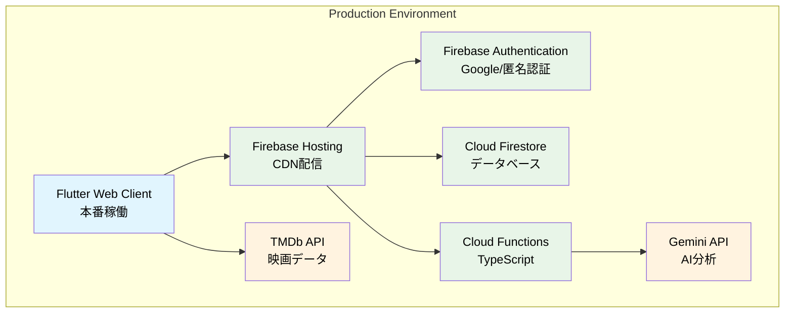

## 1. プロジェクト概要

### 1.1. ターゲットユーザー

本システム「FilmFlow」の主要なターゲットユーザーは，映画選択に際して以下のような課題を抱える映画愛好家である．

*   **選択肢の多さによる疲弊**: 現代において利用可能な映画作品は膨大であり，その中から自身の興味や気分に合致する一本を見つけ出すプロセスは，しばしば時間と労力を要する．
*   **既存推薦システムの限界**: 多くの既存推薦システムは，ユーザーの過去の視聴履歴や明示的な評価，あるいは一般的な人気度に基づいた推薦を行う．しかし，これによりユーザーの潜在的な嗜好や，言語化されていない微細な感情を捉えきれない場合がある．結果として，画一的な推薦や，既に知っている作品の再提示に留まる傾向がある．
*   **新たな発見への欲求**: ユーザーは，自身の好みに深く合致しつつも，これまで知らなかった新たなジャンルや監督，テーマの作品を発見したいという欲求を持つ．

### 1.2. 課題

現在の映画推薦システムが直面する主な課題は以下の通りである．

*   **パーソナライゼーションの深度不足**: ユーザーの真の好みを深く理解し，それに基づいて高精度な推薦を行うためのメカニズムが不足している．特に，ユーザーが言語で表現する「感想」や「感情」から，その背後にある潜在的な嗜好を抽出する能力が限定的である．
*   **コールドスタート問題**: 新規ユーザーや，レビュー履歴が少ないユーザーに対して，適切な推薦を行うことが困難である．十分なデータがない場合，推薦の精度が著しく低下する．
*   **推薦理由の不透明性**: 推薦された映画がなぜ自身に推奨されたのか，その根拠が不明瞭な場合が多い．これにより，ユーザーは推薦に対する信頼感を持ちにくく，結果として推薦された作品を視聴するモチベーションが低下する可能性がある．
*   **プラットフォーム間の分断**: ユーザーが利用するデバイス（PC，スマートフォンなど）によって，映画体験が分断されることがある．シームレスな体験を提供するためには，クロスプラットフォーム対応が不可欠である．

### 1.3. ソリューションとFilmFlowの機能

本プロジェクト「FilmFlow」は，上記の課題を解決するために開発されたAIを活用した次世代映画推薦システムである．ユーザーが記述した映画レビューをGoogleのGemini AIが詳細に分析し，個人の潜在的な好みを理解する．この分析結果に基づき，高精度かつパーソナライズされた映画推薦を提供する．

FilmFlowの主要機能は以下の通りである．

1.  **AIによる詳細なレビュー分析**
    *   **機能概要**: ユーザーが投稿した映画レビューのテキストデータを，Google Gemini APIを通じて分析する．このプロセスにより，単なるキーワード抽出に留まらず，レビューに含まれる感情，特定のテーマへの言及，登場人物やストーリー展開に対する評価など，多角的な情報を抽出する．
    *   **技術的側面**: 自然言語処理（NLP）技術を活用し，感情分析（ポジティブ，ネガティブ，ニュートラル，および特定の感情の強度），エンティティ抽出（人名，地名，作品名，ジャンル），トピックモデリング（レビューがどのテーマに強く関連しているか）を行う．これにより，ユーザーの映画に対する多角的な好みを詳細に把握し，プロファイリングの精度を向上させる．
2.  **パーソナライズされた映画推薦**
    *   **機能概要**: AIが分析したユーザーの嗜好プロファイルに基づき，数百万本の映画データベースの中から，ユーザーに最適な作品を厳選して推薦する．推薦された作品には，その推薦理由が具体的に提示される．
    *   **技術的側面**: コンテンツベースフィルタリングと協調フィルタリングを組み合わせたハイブリッド推薦アルゴリズムを採用する．コンテンツベースフィルタリングでは，ユーザーの過去のレビューから抽出された嗜好と映画のメタデータ（ジャンル，監督，俳優，キーワードなど）の類似度を基に推薦を行う．協調フィルタリングでは，ユーザーと類似した嗜好を持つ他のユーザーの評価履歴を参考に推薦を行う．これにより，ユーザーの既知の好みを深掘りしつつ，新たな発見も促す．推薦理由の生成には，Gemini AIのテキスト生成能力を活用し，ユーザーの嗜好プロファイルと推薦作品の特性を関連付けて説明する．
3.  **クロスプラットフォーム対応**
    *   **機能概要**: Flutterフレームワークを採用することで，単一のコードベースからWebブラウザ，iOS，Androidの各プラットフォーム向けアプリケーションを生成し，シームレスなユーザー体験を提供する．
    *   **技術的側面**: Flutterの宣言的UIと高性能なレンダリングエンジンにより，各プラットフォームでネイティブに近いパフォーマンスと一貫したUI/UXを実現する．これにより，ユーザーはデバイスを問わず，自身の映画体験を継続できる．
4.  **検索機能と映画情報提供**
    *   **機能概要**: ユーザーはタイトル，公開年などの多様な条件で映画を検索できる．また，TMDb APIと連携し，映画のポスター，概要，キャスト，スタッフ，評価，予告編などの詳細情報を提供する．
    *   **技術的側面**: 検索機能はCloud Firestoreのインデックス機能と組み合わせることで高速なクエリを実現する．TMDb APIからのデータ取得は，バックエンドのCloud Functionsを介して行い，必要に応じたデータキャッシュを行うことで，フロントエンドの負荷を軽減する．
5.  **セキュアな利用環境**
    *   **機能概要**: ユーザーの個人情報およびレビューデータの安全性を確保するため，堅牢な認証システムとデータ保護メカニズムを導入する．
    *   **技術的側面**: Firebase Authenticationを利用して，Googleアカウント連携を提供する．ユーザーデータやレビューデータはCloud Firestoreに保存され，Firebase Security Rulesによって厳格なアクセス制御が適用される．これにより，不正アクセスやデータ漏洩のリスクを最小限に抑える．

## 2. システムアーキテクチャ

FilmFlowは，Googleが提供するクラウドサービスとモダンな開発フレームワークを組み合わせることで，高いパフォーマンスと堅牢性を実現している．Clean Architectureに基づいた設計思想を採用し，各コンポーネントの疎結合化と高い保守性，拡張性を確保している．

### 2.1. 全体アーキテクチャ図

本図は，FilmFlowシステムの全体的な構成要素と，それらの間の主要な連携を示している．フロントエンド（Flutter Web Client）からバックエンド（Firebase Hosting, Authentication, Firestore, Cloud Functions）へのリクエストフロー，および外部API（Gemini API, TMDb API）との連携を示す．各コンポーネントは，その役割と責任が明確に分離されており，スケーラビリティと可用性を考慮した設計となっている．

### 2.2. データフロー図

本図は，ユーザーレビューがシステム内でどのように処理され，最終的にパーソナライズされた推薦として表示されるかを示すデータフローである．ユーザーレビューの入力から，AI感情分析，推薦生成，そしてユーザーインターフェースへの反映に至るまでの各ステップにおけるデータの流れと処理の連鎖を表現している．このフローは，ユーザーの行動がどのように推薦システムに影響を与え，最終的な推薦結果に結びつくかを明確にする．

このアーキテクチャにより，ユーザーからのリクエストはFirebase Hostingを通じて高速に配信され，認証，データ管理，AI分析といった処理は，最適化されたFirebaseサービスとCloud Functionsによって効率的に実行される．AIによるレビュー分析と推薦生成はCloud Functions上でサーバーレスに動作するため，高いスケーラビリティとコスト効率を実現する．

## 3. デモンストレーション

FilmFlowの機能とユーザーフローを具体的に理解するため，以下のデモ動画を参照のこと．本動画では，ログインから，映画レビューの投稿，そしてAIによるパーソナライズされた映画推薦が生成され，表示されるまでの一連の流れを示している．

https://youtu.be/sxOOpjSxniI

## 4. アプリケーションアクセス

FilmFlowはWebアプリケーションとして公開されており，以下のURLからアクセス可能である．本URLを通じて，実際のシステムを体験することができる．

[https://movie-recommendation-sys-21b5d.web.app](https://movie-recommendation-sys-21b5d.web.app)

## 5. 開発情報

FilmFlowは，以下の主要な技術スタックと開発プラクティスを用いて開発された．

*   **フロントエンド**: Flutter (Dart) - クロスプラットフォーム対応のUIフレームワークとして採用．状態管理にはRiverpodを使用し，効率的かつ宣言的なUI開発を実現している．
*   **バックエンド**: Firebase (Cloud Functions for Firebase, Cloud Firestore, Firebase Authentication, Firebase Hosting) - サーバーレスアーキテクチャの基盤として採用．スケーラブルなバックエンドロジック，リアルタイムデータベース，認証機能，高速なコンテンツ配信を提供する．
*   **AI/ML**: Google Gemini API - ユーザーレビューの高度な自然言語処理（感情分析，嗜好抽出，推薦理由生成）に利用．
*   **外部データ**: TMDb API - 映画のメタデータ（タイトル，概要，キャスト，ポスターなど）取得に利用．
