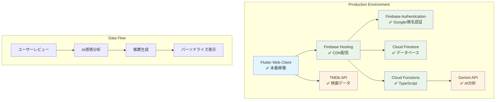

## 🎬 映画選びの悩み、AIが解決します！

「次に見る映画、何にしよう…」「せっかく見るなら、本当に自分に合った映画を見たい！」

映画好きなら誰もが一度は抱えるこの悩み。膨大な作品の中から、本当に心に響く一本を見つけるのは至難の業です。友人のおすすめも良いけれど、本当に自分の好みに合うとは限りませんよね。

そんなあなたの悩みを解決するために生まれたのが、AIを活用した次世代映画レコメンドシステム「**FilmFlow**」です！

FilmFlowは、あなたが書いた映画レビューをGoogleの最先端AI「Gemini」が詳細に分析し、あなたの潜在的な好みを深く理解します。そして、その分析結果に基づいて、**あなただけにパーソナライズされた「運命の一本」を推薦する**、全く新しい映画体験を提供します。

もう、映画選びで迷う必要はありません。FilmFlowが、あなたの映画ライフをより豊かに、より感動的に変革します。

## ✨ FilmFlowが提供する、これまでにない映画体験

FilmFlowは、単なる映画データベースではありません。AIの力を最大限に活用し、ユーザー一人ひとりに寄り添うインテリジェントなレコメンドシステムです。

### 1. 📝 あなたのレビューが「最高のコンシェルジュ」に変わる！AIによる詳細なレビュー分析

FilmFlowの核となるのが、あなたの映画レビューをAIが分析する機能です。

「この映画は、登場人物の心理描写が繊細で、特にラストシーンのどんでん返しには鳥肌が立ちました！」
「SFは好きだけど、難解すぎる設定は苦手。もっと気軽に楽しめる作品がいいな。」

あなたがレビューに書く、そんな何気ない一言一言が、AIにとっては貴重な情報源となります。GoogleのGemini APIが、あなたのレビューから以下の情報を詳細に分析します。

*   **感情分析**: あなたがその映画に対して抱いた感情（ポジティブ、ネガティブ、ニュートラル）をスコア化し、喜び、興奮、悲しみといった具体的な感情までを識別します。
*   **好み抽出**: レビュー内で言及されたジャンル、テーマ、俳優、監督、キーワードなどを抽出し、あなたの潜在的な好みをプロファイリングします。例えば、「SF」というジャンルだけでなく、「テクノロジーの進化」というテーマや、「クリストファー・ノーラン監督」といった具体的な嗜好までを把握します。

この詳細な分析により、FilmFlowはあなたの映画の好みを多角的に、そして深く理解することができます。

### 2. 🤖 あなただけの「運命の一本」に出会う！パーソナライズされた映画推薦

AIがあなたの好みを深く理解したら、いよいよFilmFlowの真骨頂です。

FilmFlowは、分析されたあなたの嗜好プロファイルに基づき、数百万本もの映画の中から、**あなたに最適な映画を厳選して推薦します**。

*   **ハイブリッド推薦アルゴリズム**: コンテンツベースフィルタリング（あなたの過去の好みと似た映画を推薦）と、協調フィルタリング（あなたと似た好みのユーザーが高評価した映画を推薦）を組み合わせた、高度なハイブリッドアルゴリズムを採用しています。これにより、単なる類似性だけでなく、新たな発見も促します。
*   **推薦理由の可視化**: 「なぜこの映画があなたにおすすめなのか？」FilmFlowは、AIが生成した具体的な推薦理由を提示します。例えば、「あなたはSFとヒューマンドラマを好む傾向があり、特に『未来の技術と人間の倫理』というテーマに興味があるようです。この映画は、まさにその要素を兼ね備えています。」といった形で、納得感のある推薦理由が示されます。これにより、推薦された映画への興味がさらに深まります。
*   **多様性ブースト**: 同じジャンルばかりにならないよう、推薦リストにはジャンルや監督の多様性も考慮されています。これにより、あなたの映画の視野が広がり、新たな「お気に入り」が見つかる可能性が高まります。

### 3. 🌐 いつでもどこでも映画体験！クロスプラットフォーム対応

FilmFlowは、Flutterを採用しているため、Webブラウザはもちろん、iOSやAndroidのスマートフォンアプリとしてもシームレスに動作します。PCでじっくり映画を探し、移動中にスマホでレビューを投稿するといった、あなたのライフスタイルに合わせた自由な映画体験が可能です。

### 4. 🔍 豊富な検索機能と映画情報

AI推薦だけでなく、FilmFlowは映画を探すための基本的な機能も充実しています。

*   **多彩な検索**: タイトル、ジャンル、公開年など、様々な条件で映画を検索できます。
*   **詳細な映画情報**: TMDb APIと連携し、ポスター、概要、キャスト、スタッフ、評価など、映画に関する豊富な情報を網羅しています。
*   **人気・新着・ジャンル別一覧**: 今話題の映画や、最新の公開作品、特定のジャンルの映画を簡単にチェックできます。

### 5. 🔒 安心・安全な利用環境

FilmFlowは、Firebase Authenticationによるセキュアな認証システムを採用しており、あなたの個人情報やレビューデータは厳重に保護されます。また、Firebase Security Rulesにより、データへのアクセスは厳しく制限され、安全な利用環境を提供します。

## 🛠️ FilmFlowを支える最先端技術スタック

FilmFlowは、Googleが提供する強力なクラウドサービスと、モダンな開発フレームワークを組み合わせることで、高いパフォーマンスと堅牢性を実現しています。

| カテゴリ | 技術 | 詳細 |
|---|---|---|
| **フロントエンド** | Flutter (Dart) | Web、iOS、Androidに対応するクロスプラットフォームUIフレームワーク。Riverpodによる効率的な状態管理、Material Design 3による美しいUIを実現。 |
| **バックエンド** | Cloud Functions for Firebase (TypeScript) | サーバーレスでスケーラブルなバックエンドロジック。TypeScriptで記述され、レビュー分析や推薦生成の処理を実行。 |
| **データベース** | Cloud Firestore | リアルタイム同期が可能なNoSQLデータベース。ユーザーデータ、映画データ、レビュー、推薦結果などを格納。 |
| **認証** | Firebase Authentication | Googleアカウント連携による安全で簡単なユーザー認証機能を提供。 |
| **AI / ML** | Google Gemini API | レビューの感情分析、好み抽出、推薦理由の生成に活用。自然言語処理の最先端技術。 |
| **映画データ** | TMDb API | 映画の基本情報、ポスター、キャスト、ジャンルなどを取得するための外部API。 |
| **ホスティング** | Firebase Hosting | 高速なCDN（コンテンツ配信ネットワーク）を通じて、アプリケーションを世界中に配信。 |
| **CI/CD** | GitHub Actions | コードのテスト、ビルド、デプロイを自動化し、開発効率と品質を向上。 |

## 🏗️ 堅牢でスケーラブルなシステムアーキテクチャ

FilmFlowは、Clean Architectureに基づいた堅牢な設計思想を採用しています。これにより、各コンポーネントが疎結合になり、高い保守性と拡張性を実現しています。

以下に、FilmFlowのシステム全体アーキテクチャ図を示します。

**（注：上記のMermaidコードを画像としてレンダリングし、ここに埋め込んでください）**

このアーキテクチャにより、ユーザーからのリクエストはFirebase Hostingを通じて高速に配信され、認証、データ管理、AI分析といった複雑な処理は、それぞれ最適化されたFirebaseのサービスとCloud Functionsによって効率的に実行されます。特に、AIによるレビュー分析と推薦生成はCloud Functions上でサーバーレスに動作するため、高いスケーラビリティとコスト効率を実現しています。

## 🎥 FilmFlowのデモ動画

言葉だけでは伝わりにくいFilmFlowの魅力を、ぜひ動画でご覧ください！
ユーザー登録からレビュー投稿、そしてAIによるパーソナライズ推薦が生成されるまでの流れを、3分以内でご紹介します。

**（注：ここに3分以内のデモ動画を埋め込んでください）**

## 🚀 さあ、あなたもFilmFlowを体験しよう！

FilmFlowは、現在Webアプリケーションとして公開されており、どなたでもすぐに体験いただけます。

**FilmFlowを今すぐ体験する！**
[https://movie-recommendation-sys-21b5d.web.app](https://movie-recommendation-sys-21b5d.web.app)

あなたの映画レビューが、AIによって新たな価値を生み出し、これまでにない映画体験へと導きます。
ぜひFilmFlowを試して、あなただけの「運命の一本」を見つけてください！

---
**開発者より**

FilmFlowは、FlutterとFirebase、そしてGoogle Gemini APIという最先端技術を組み合わせることで、個人開発ながらもプロダクションレベルの品質と機能を追求しました。Clean Architectureの採用、徹底したテスト、CI/CDパイプラインの構築により、高い保守性と拡張性を確保しています。

このプロジェクトを通じて、AIがユーザー体験をどのように変革できるか、そしてモダンなクラウド技術がいかに迅速な開発を可能にするかを実感しました。

ご意見やフィードバックはいつでも歓迎です。
FilmFlowが、あなたの映画ライフをより豊かにする一助となれば幸いです。
